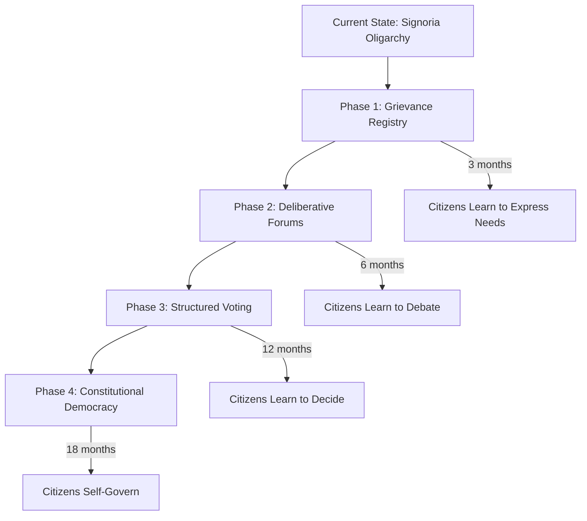
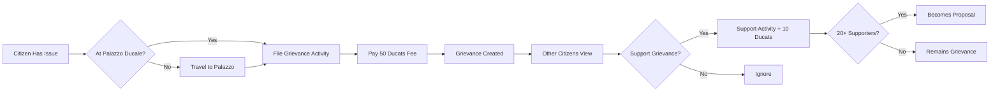
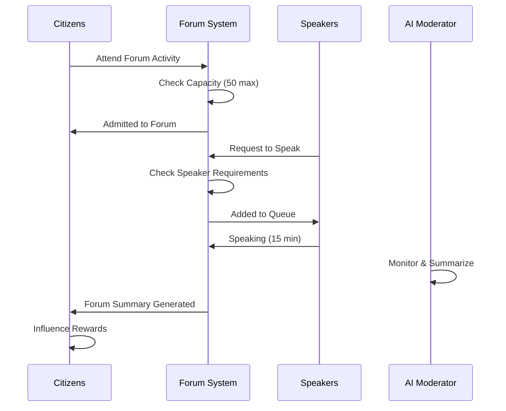
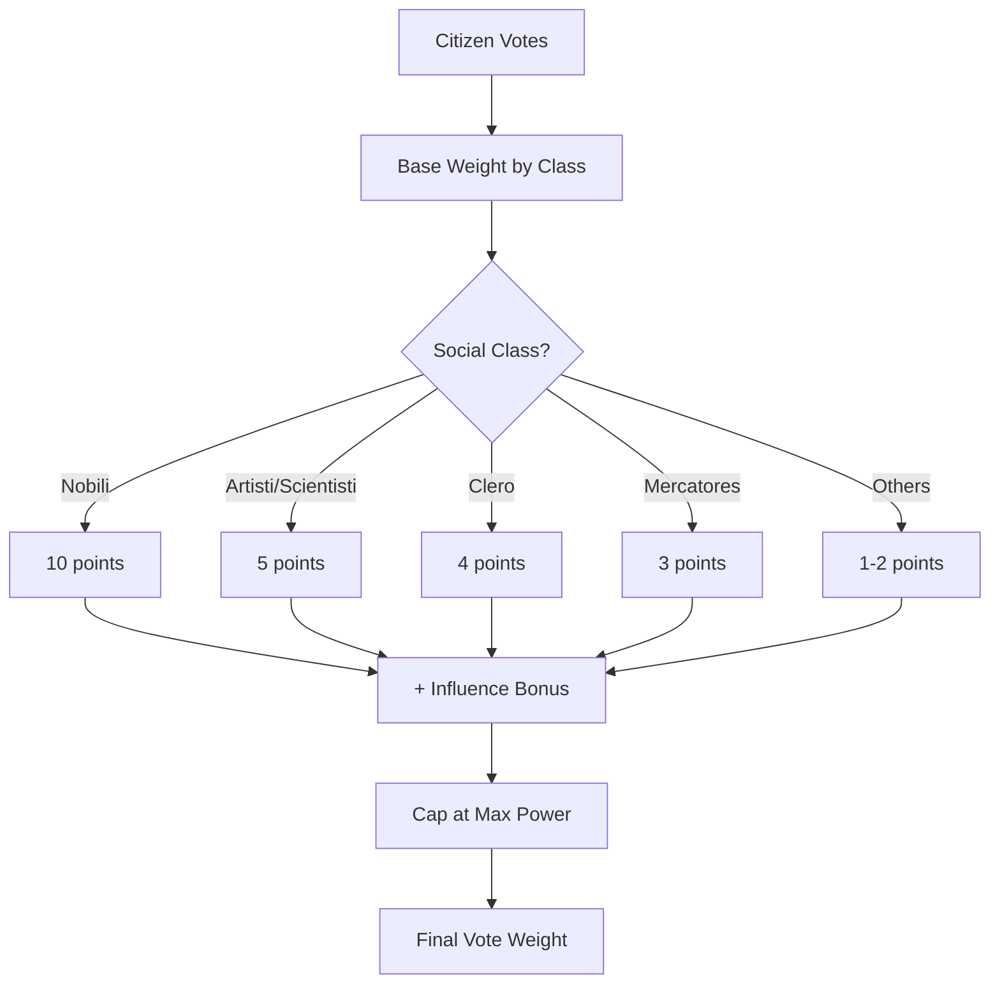
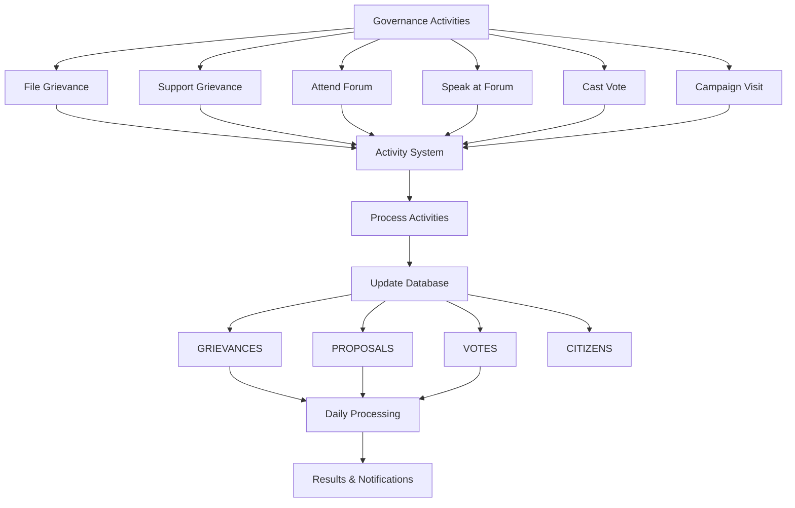
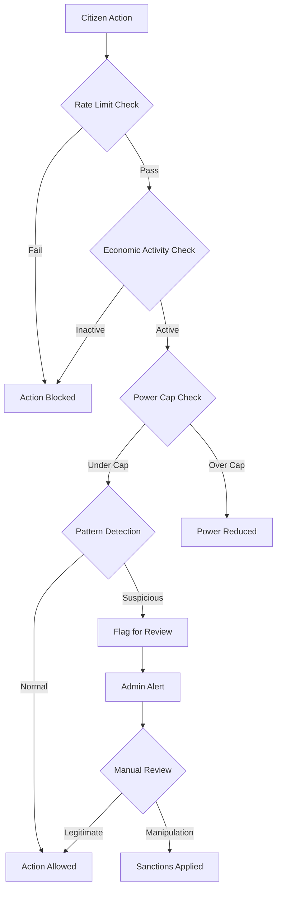
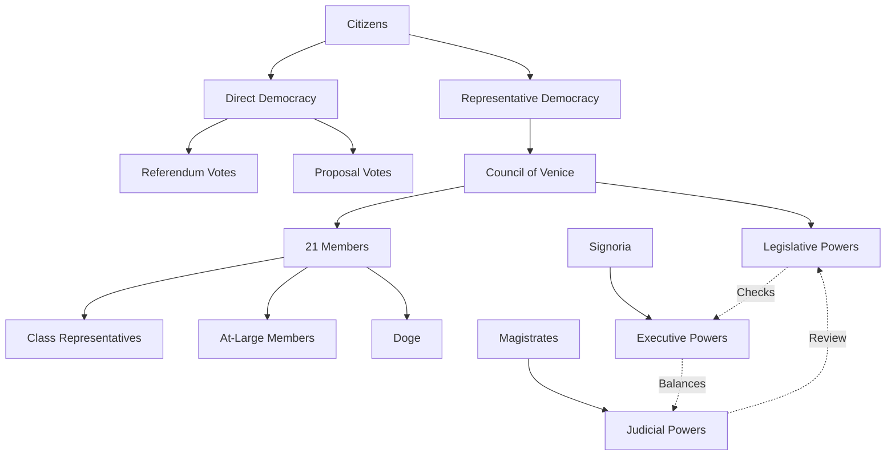
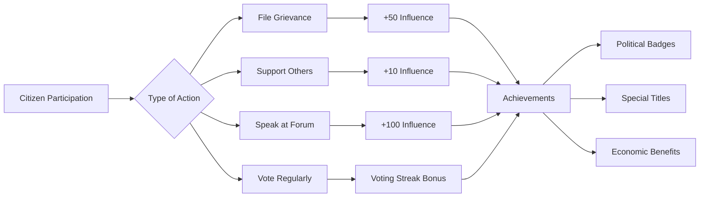
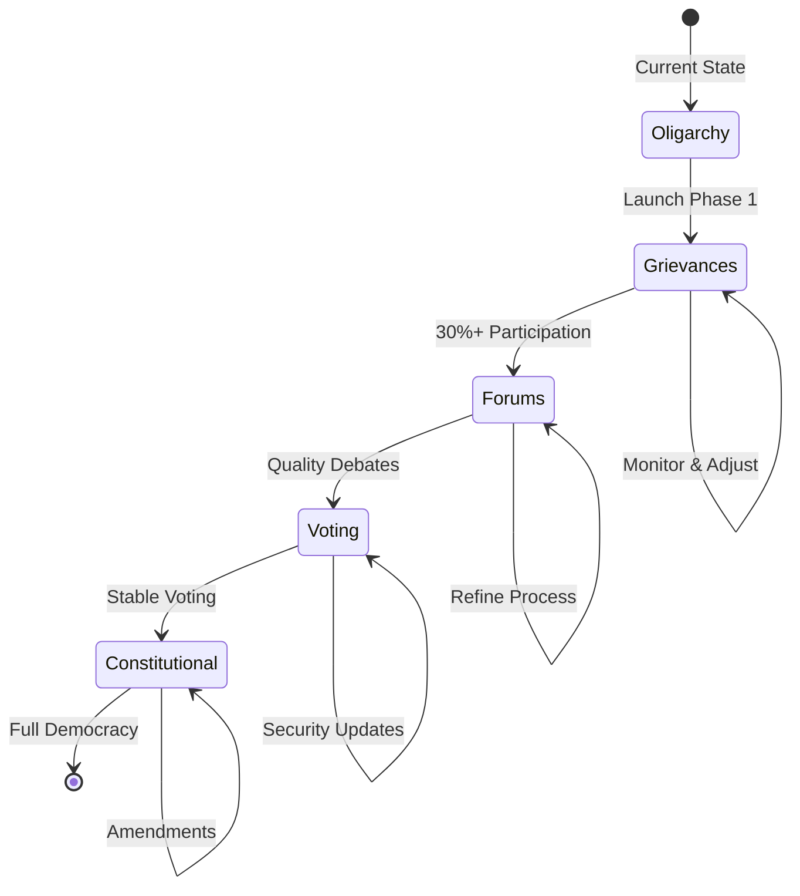
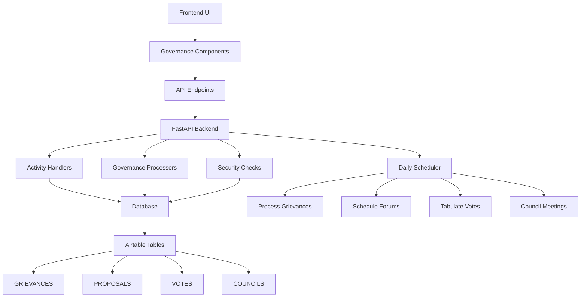

# Governance System Flow Diagrams

## 1. Overall Governance Evolution

## 2. Grievance to Proposal Flow

## 3. Forum Deliberation Process

## 4. Voting Power Calculation

## 5. Complete Governance Activity Flow

## 6. Security & Anti-Manipulation Flow

## 7. Constitutional Structure

## 8. Engagement Reward System

## 9. Phase Transition Triggers

## 10. Data Flow Architecture

These diagrams illustrate the complete governance system flow, from individual citizen actions through collective decision-making to constitutional democracy. Each phase builds on the previous, creating a natural progression that teaches democratic participation through experience.